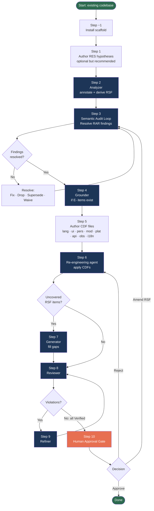

# SDAIS — Re-Engineering Workflow

**Version:** v0.10.0 | See [INTRODUCTION.md](INTRODUCTION.md) for concepts and prerequisites.

Most real-world systems do not start with a clean specification. They start with code — accumulated over years, built by people who are often no longer around, with intent that lives in git history at best and in tribal knowledge at worst. SDAIS-RE is the workflow for those systems.

The starting point is not an exact specification. It is the existing codebase, whatever documentation exists, and your own working knowledge of what the system is supposed to do. From that rough starting point, you will build a formal specification in a loop — annotating, auditing, refining — and then apply targeted transformations to bring the system to a new target state.

---

## When to Use SDAIS-RE

- You are migrating an existing system to a new language, framework, or platform.
- You are extracting a monolith into modules or services.
- You need a formal specification for a system that was built without one.
- You are adding observability, a new persistence layer, or a new API style to an existing system.

If you are building from scratch, use the greenfield workflow ([GREENFIELD.md](GREENFIELD.md)).

---

## Process Overview



Dark blue = AI agent step. Orange = human decision gate.

---

## Step −1 — Install the Scaffold

Copy the SDAIS distribution files into your project root and run `bash install <project-name>` as described in [GREENFIELD.md](GREENFIELD.md) Step −1. The same scaffold is used for both workflows.

---

## Step 1 — Author RES Hypotheses (optional but recommended)

Before running the Analyzer, capture what you believe the existing system does as Re-engineering Specification (RES) hypothesis files in `sdais/res/v1/`. This primes the Analyzer and gives it hypotheses to confirm, refute, or refine — which produces better-quality derived RSF items than starting from zero.

File naming mirrors the RSF convention: `res-fr-NNNN-<description>.md`, `res-nfr-NNNN-<description>.md`, `res-c-NNNN-<description>.md`.

### RES item format

```markdown
# RES-FR-0001: Short Title

**Type:** Functional Requirement
**Status:** Hypothesis
**Confidence:** Low | Medium | High
**Introduced:** v1 (YYYY-MM-DD)

## Hypothesis

[What you believe this part of the system does. Imprecision is fine here.]

## Evidence

[Optional. Code references, comments, documentation that support the hypothesis.]

## Open Questions

[What you are unsure about.]
```

**Confidence** governs Analyzer behaviour:

- `High` — strong evidence; Analyzer sample-checks.
- `Medium` — partial evidence; Analyzer validates carefully.
- `Low` — weak hypothesis; Analyzer performs deep analysis before accepting.

The code is always authoritative. When the Analyzer finds that a hypothesis contradicts the code, it opens a `RES-CONTRADICTS-CODE` finding and you decide which is right.

**Status values:** `Hypothesis | Confirmed | Refuted | Refined`

---

## Step 2 — Run the Analyzer

**Prompt:** `sdais/prompts/analyzer.md` | **Recommended model:** High-coding (e.g. Claude Sonnet)

Point the Analyzer at the existing codebase and any RES files you authored in Step 1.

The Analyzer works additively — it never modifies existing logic, signatures, or comments. It only adds:

1. `[ANN]` blocks to every callable unit and type. Each block gets a freshly generated `(ANN-ID)`, a reconstructed `(TASK)`, inferred `(PRE)` and `(POST)`, and a `(CONFIDENCE)` label (`Inferred-High`, `Inferred-Medium`, or `Inferred-Low`) reflecting how certain the Analyzer is about its inference.
2. Formal RSF item files in `sdais/rsf/v1/` derived from observed behaviour.
3. RAR finding files in `sdais/rar/v1/` for anything unclear — using categories `RES-CONTRADICTS-CODE` (hypothesis contradicted by code) and `CODE-INTENT-UNCLEAR` (behaviour cannot be mapped to any requirement).

After the pass the Analyzer outputs a summary:

```
Analyzer pass complete.
Source files annotated: 24.
[ANN] blocks written: 187.
RSF items derived: 31 (fr: 18, nfr: 8, c: 5).
RAR findings opened: 4 (RES-CONTRADICTS-CODE: 1, CODE-INTENT-UNCLEAR: 3).
Blocks with Inferred-High: 142.
Blocks with Inferred-Medium: 38.
Blocks with Inferred-Low: 7.
```

The `(ANN-ID)` values assigned here are permanent. They will be preserved through every subsequent transformation and provide a stable audit trail linking every unit in the final transformed codebase back to the original.

---

## Step 3 — Semantic Audit Loop

**Prompt:** `sdais/prompts/semantic-auditor.md` | **Recommended model:** High-reasoning (e.g. Claude Opus)

Run the standard semantic audit on the RSF items derived by the Analyzer. Follow the same procedure as [GREENFIELD.md](GREENFIELD.md) Step 2 exactly. Resolve all standard findings (`AMBIGUOUS`, `INCOMPLETE`, `CONTRADICTORY`, `INFEASIBLE`, `UNTESTABLE`, `UNQUANTIFIED`) before continuing.

Additionally resolve any re-engineering-specific findings:

- **`RES-CONTRADICTS-CODE`** — either correct the RES hypothesis (mark it `Refuted` and create a new RSF item reflecting what the code actually does) or correct the code if the hypothesis represents the intended behaviour.
- **`CODE-INTENT-UNCLEAR`** — clarify intent by examining surrounding context, documentation, or domain knowledge; then either derive an RSF item or mark the code explicitly as out of scope.

These findings require human judgement. The Analyzer surfaces them; you resolve them.

---

## Step 4 — Ground Environment Items

**Prompt:** `sdais/prompts/grounder.md` | **Recommended model:** High-reasoning (e.g. Claude Opus or Sonnet)

Run the Grounder as described in [GREENFIELD.md](GREENFIELD.md) Step 3. This step is especially important in re-engineering scenarios: `E-` items typically describe infrastructure that already exists and must be confirmed accurately before any transformation touches it.

---

## Step 5 — Author CDF Files

Define the desired transformations as Change Definition Files (CDFs) in `sdais/cdf/v<N>/`. One file per transformation dimension. CDFs are orthogonal and combinable — multiple active CDFs transform the same codebase in a single Re-engineering pass.

File naming: `<category>-NNNN-<description>.md`

| Prefix | Transformation |
|---|---|
| `lang-` | Language migration (e.g. Java → Go, Python → TypeScript) |
| `ui-` | UI or frontend framework replacement |
| `i18n-` | Localisation — adding multi-language support |
| `pers-` | Persistence layer change (e.g. SQL → document store) |
| `mod-` | Modularisation — monolith ↔ modules ↔ services |
| `plat-` | Platform change — bare metal, container, cloud |
| `api-` | API style change — REST, gRPC, synchronous, asynchronous |
| `obs-` | Observability introduction — logging, metrics, tracing |

### CDF file format

```markdown
# LANG-0001: Java 8 to Go 1.22 Migration

**Category:** lang-
**Status:** Active
**Affects:** all

## Source

Language: Java 8
Build tool: Maven
Runtime: JVM 8

## Target

Language: Go 1.22
Build tool: go build
Runtime: Linux/amd64 binary

## Transformation Rules

1. Replace each Java class with a Go struct and its associated functions.
2. Replace checked exceptions with Go error return values.
3. Replace Java interfaces with Go interfaces.
4. Replace Maven dependency declarations with Go module imports.
5. Replace Java generics with Go generics (1.18+) where applicable.

## Constraints to Preserve

- All (CONSTRAINT) labels from [ANN] blocks must be honoured in the target.
- All (POST) conditions must be preserved in the Go implementation.

## Acceptance

- All RSF items covered by the transformation produce equivalent behaviour
  in the Go implementation.
- All [ANN] blocks carry the same (ANN-ID) as the original Java unit.
```

The `**Affects:**` field lists either specific `(ANN-ID)` references (comma-separated) or `all`. When `all`, the transformation rules apply to every unit in the codebase.

Note: when switching languages (e.g. Python to Go), the Re-engineering agent discards the source language syntax entirely and re-synthesises in the target language. The `[ANN]` blocks, including their `(ANN-ID)` values, are reset to `(VERIFIED) false` and `(ROUND) 0` since the implementation is new — but the IDs themselves are preserved, maintaining the audit trail.

---

## Step 6 — Run the Re-engineering Agent

**Prompt:** `sdais/prompts/re-engineering.md` | **Recommended model:** High-coding (e.g. Claude Sonnet)

Run the Re-engineering agent, providing the annotated codebase, all active CDF files, and all active RSF items.

The Re-engineering agent:

- Applies each CDF's transformation rules to the units listed in `Affects`.
- Produces transformed code in the target language, framework, or architecture.
- Preserves all `(ANN-ID)` values according to these rules:
  - **One-to-one:** transformed unit carries the original `(ANN-ID)` unchanged.
  - **Split:** when one unit splits into multiple, the original `(ANN-ID)` stays with the unit retaining primary responsibility; new units receive freshly generated IDs.
  - **Merge:** when multiple units merge into one, the merged unit lists all original `(ANN-ID)` values comma-separated.
- Identifies any RSF items not covered by the transformation and hands them off to the Generator with an explicit list.

After the pass the Re-engineering agent outputs a summary:

```
Re-engineering pass complete.
CDFs applied: 1 (lang-0001-java-to-go.md).
Units transformed: 187.
(ANN-ID) preserved (one-to-one): 178.
(ANN-ID) split: 3 original IDs → 9 new units.
(ANN-ID) merged: 6 original IDs → 2 merged units.
New (ANN-ID) generated: 9.
RSF items covered: 29.
RSF items not covered (handed to Generator): 2 — FR-0027, FR-0031.
```

---

## Step 7 — Fill Gaps with the Generator

**Prompt:** `sdais/prompts/generator.md` | **Recommended model:** High-coding (e.g. Claude Sonnet)

If the Re-engineering agent reports uncovered RSF items, run the Generator to synthesise implementations for those items only. The Generator reads the partially-transformed codebase and the list of uncovered RSF item IDs. It does not touch units already transformed by the Re-engineering agent.

---

## Steps 8–10 — Standard Review Loop

From this point, follow the greenfield workflow:

- **Step 8 (Review):** The Reviewer checks all `[ANN]` blocks — those from the Re-engineering agent, any gaps filled by the Generator, and any blocks carried forward from the Analyzer. The dependency cascade check applies as usual.
- **Step 9 (Refine):** Resolve violations as directed by the Reviewer's hints.
- **Step 10 (Approval Gate):** Approve, amend RSF and re-audit, or reject and re-run the Re-engineering agent.

The `(ANN-ID)` values established by the Analyzer and preserved by the Re-engineering agent provide a stable audit trail linking every unit in the transformed codebase back to the original annotated unit — even across a complete language change.

---

## Further Reading

- [GREENFIELD.md](GREENFIELD.md) — The canonical SDAIS workflow, which the re-engineering loop merges into from Step 8 onwards.
- [GLOSSARY.md](GLOSSARY.md) — RES item types, CDF category prefixes, and all annotation identifiers.
